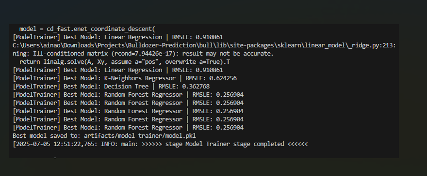
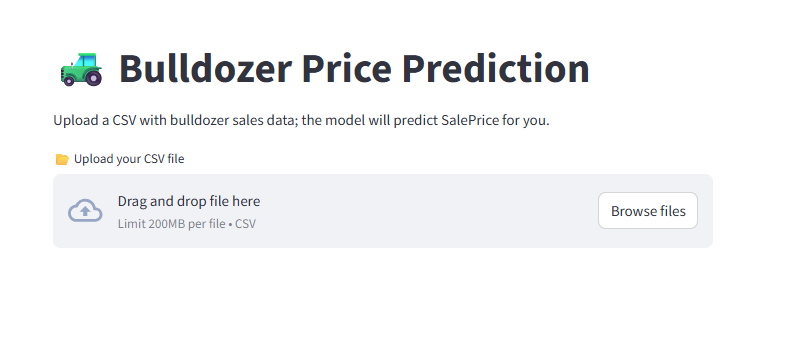
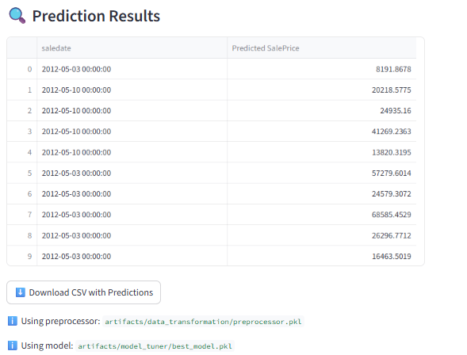

## 🚜 Bulldozer Price Prediction — Portfolio Project

Welcome to the Bulldozer Price Prediction project! This end-to-end machine learning solution was inspired by the Kaggle Bluebook for Bulldozers competition, which aimed to predict the auction sale price of bulldozers using historical data. This project adapts that challenge into a fully modular, production-ready system showcasing strong skills in data science, MLOps, and full-stack ML deployment.

# ✨ Highlights

✅ Complete ML pipeline from raw data to deployment✅ Multiple model comparisons and hyperparameter tuning✅ Interactive web app for real-time predictions✅ Dockerized and Kubernetes-ready for cloud scalability

# 📄 Project Overview

We leverage historical auction data to forecast bulldozer prices using a robust and reproducible ML pipeline. The system demonstrates solid engineering practices, extensive model experimentation, and readiness for real-world deployment.

# 🏗️ Pipeline Breakdown

Data Ingestion: Reads raw data files, parses dates, and engineers additional time-based features.

Data Transformation: Splits data into train, validation, and test sets using year-based splits, applies preprocessing with imputation and encoding.

Model Training: Trains several regressors (Linear, Tree-based, Boosting models), selects the best model based on RMSLE.

Model Tuning: Performs hyperparameter optimization using randomized search and time series cross-validation for robust performance improvements.

Model Evaluation: Evaluates models using RMSLE. Final validation RMSLE achieved: 0.2610.

# 💻 Interactive Web App

Developed using Streamlit, enabling users to:

Upload custom CSV data

Preview and process data

Generate price predictions

Download results with predictions attached

# 🚀 Deployment

Docker: Ensures reproducible and consistent builds.

Kubernetes: YAML configurations (deployment.yaml, service.yaml, deploy.yml) for scalable cloud deployment.

# ⚙️ Configuration & Structure

All parameters controlled via config.yaml.

Clean, modular structure within bullprediction package.

Automated project structure creation via template.py.

# 📊 Evaluation Metric

{
    "validation_rmsle": 0.2610
}

# 🏃 Getting Started

git clone https://github.com/Opeyemi/Bulldozer-Prediction.git
cd Bulldozer-Prediction
pip install -r requirements.txt
python main.py          # Run the end-to-end ML pipeline
streamlit run app.py    # Launch the web app

# 🌟 Screenshots

Model Trainer results

Streamlit file upload view

Prediction results table

# 🙋 About Me

Name: Opeyemi Aina

GitHub: Spencer0013

Email: ainaopeyemi53@gmail.com

🚀 A polished, competition-inspired project demonstrating production-ready machine learning and MLOps expertise.

